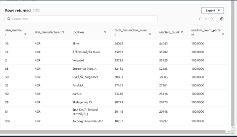
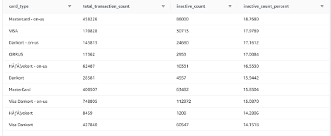

# README.md

## Introduction

Welcome to the Spar Nord Bank ATM Transactions Analysis Project! This project demonstrates the development of a batch ETL pipeline using widely adopted tools and technologies such as Apache Sqoop, Apache PySpark, Amazon S3, and Amazon Redshift. The objective of this project is to extract, transform, and load (ETL) transactional data from a MySQL RDS database into Amazon Redshift, followed by performing analytical queries to derive valuable insights.

### Use Case

Spar Nord Bank needs to optimize its ATM refilling strategy by analyzing ATM usage patterns, particularly withdrawals, and their influencing factors such as weather, time, and location. Additionally, the bank seeks to gain insights into ATM failures and transaction behaviors to enhance overall ATM management and customer service.

### Project Workflow

The project involves the following steps:

1. **Data Extraction**: Extract transactional data from MySQL RDS using Apache Sqoop and load it into HDFS.
2. **Data Transformation**: Utilize Apache PySpark to transform the extracted data into a format compatible with the target schema, which includes creating dimension and fact tables.
3. **Data Loading**: Load the transformed data from HDFS to Amazon S3.
4. **Redshift Setup**: Create a Redshift cluster, define the schema, and load the data from S3 to Redshift tables.
5. **Data Analysis**: Perform analytical queries on the loaded data to answer business questions and derive insights.

### Tools and Technologies

- **Apache Sqoop**: For data ingestion from MySQL RDS to HDFS.
- **Apache PySpark**: For data transformation and creating dimension and fact tables.
- **Amazon S3**: For storing the transformed data before loading it into Redshift.
- **Amazon Redshift**: For setting up a data warehouse and running analytical queries.

## Data

The dataset used in this project was sourced from Kaggle and contains detailed ATM transactional data along with weather information at the time of the transactions from around 113 ATMs across Denmark for the year 2017. The dataset comprises approximately 2.5 million records and includes various fields such as transaction date and time, ATM status, ATM details, weather conditions, transaction details, and more.

[Link to Kaggle Dataset](https://www.kaggle.com/datasets/sparnord/danish-atm-transactions)

## Data Model


The data model consists of four dimension tables and one fact table:

1. **ATM Dimension**: Contains ATM-related data including ATM ID, manufacturer, and location reference.
2. **Location Dimension**: Contains location data such as city, street name, street number, zip code, latitude, and longitude.
3. **Date Dimension**: Contains time-related data including timestamp, year, month, day, hour, and weekday.
4. **Card Type Dimension**: Contains information about different card types used in transactions.
5. **Transaction Fact**: Contains numerical and transactional data such as currency, service type, transaction amount, message codes, and weather information.

## Approach


The approach for this project is divided into the following stages:

### 1. Data Extraction

#### Data Ingestion from the RDS to HDFS using Sqoop

##### Sqoop Import command used for importing table from RDS to HDFS:

```sh
sqoop import \
--connect jdbc:mysql://upgraddetest.cyaielc9bmnf.us-east-1.rds.amazonaws.com/testdatabase \
--table SRC_ATM_TRANS \
--username student --password STUDENT123 \
--target-dir /user/ec2-user/ETL_Project/data \
-m 1
```

##### Command used to see the list of imported data in HDFS:

```sh
hadoop fs -ls /user/ec2-user/ETL_Project/data
```

##### Screenshot of the imported data:


### 2. Data Transformation

PySpark is used to:

- Define the input schema using StructType to ensure correct data types.
- Read and verify the data from HDFS.
- Create and clean dimension tables by removing duplicates and ensuring proper primary keys.
- Create the transaction fact table by joining with the dimension tables and cleaning the data.

### 3. Redshift Setup and Data Loading

A Redshift cluster is created, and tables are defined according to the target schema. Data is then copied from the S3 bucket into the respective Redshift tables.

#### Screenshots of the configuration of the RedShift cluster that you have created:


#### Setting up a database in the RedShift cluster and running queries to create the dimension and fact tables

##### Queries to create the various dimension and fact tables with appropriate primary and foreign keys:

1. **Creating Schema**

   ```sql
   create schema etlschema;
   ```
2. **Creating Location Dimension Table**

   ```sql
   create table etlschema.dim_location(
     location_id int,
     location varchar(50),
     streetname varchar(255),
     street_number int,
     zipcode int,
     lat decimal,
     lon decimal,
     primary key (location_id)
   );
   ```
3. **Creating Card-Type Dimension Table**

   ```sql
   create table etlschema.dim_card_type(
     card_type_id int,
     card_type varchar(50),
     primary key (card_type_id)
   );
   ```
4. **Creating Date Dimension Table**

   ```sql
   create table etlschema.dim_date(
     date_id int,
     full_date_time timestamp,
     year int,
     month varchar(50),
     day int,
     hour int,
     weekday varchar(50),
     primary key (date_id)
   );
   ```
5. **Creating ATM Dimension Table**

   ```sql
   create table etlschema.dim_atm(
     atm_id int,
     atm_number varchar(20),
     atm_manufacturer varchar(30),
     atm_location_id int,
     primary key(atm_id),
     foreign key(atm_location_id) references etlschema.dim_location(location_id)
   );
   ```
6. **Creating the Fact ATM Transaction Table**

   ```sql
   create table etlschema.fact_atm_trans(
     trans_id bigint,
     atm_id int,
     weather_loc_id int,
     date_id int,
     card_type_id int,
     atm_status varchar(50),
     currency varchar(20),
     service varchar(50),
     transaction_amount int,
     message_code varchar(50),
     message_text varchar(100),
     rain_3h decimal(10,3),
     clouds_all int,
     weather_id int,
     weather_main varchar(50),
     weather_description varchar(255),
     primary key(trans_id),
     foreign key(weather_loc_id) references etlschema.dim_location(location_id),
     foreign key(atm_id) references etlschema.dim_atm(atm_id),
     foreign key(date_id) references etlschema.dim_date(date_id),
     foreign key(card_type_id) references etlschema.dim_card_type(card_type_id)
   );
   ```

#### Loading data into a RedShift cluster from Amazon S3 bucket

##### Queries to copy the data from S3 buckets to the RedShift cluster in the appropriate tables:

1. **Location Dimension Table**

   ```sql
   copy etlschema.dim_location(
     location_id,location,streetname,street_number,zipcode,lat,lon
   )
   from 's3://shnkreddy/dim-location/part-00000-eb7cc902-17c3-4895-9b11-9c6a5b0390ce-c000.csv'
   iam_role 'arn:aws:iam::595818034157:role/redshift_s3_fullaccess'
   delimiter ',' region 'us-east-1' CSV;
   ```
2. **ATM Dimension Table**

   ```sql
   copy etlschema.dim_atm
   from 's3://shnkreddy/dim-atm/part-00000-2c7564c6-b985-499c-97d0-936c1bd81da9-c000.csv'
   iam_role 'arn:aws:iam::595818034157:role/redshift_s3_fullaccess'
   delimiter ',' region 'us-east-1' CSV;
   ```
3. **Card Type Dimension Table**

   ```sql
   copy etlschema.dim_card_type
   from 's3://shnkreddy/dim-card-type/part-00000-81965790-3bf7-4eb6-bdc1-37002762c0d0-c000.csv'
   iam_role 'arn:aws:iam::595818034157:role/redshift_s3_fullaccess'
   delimiter ',' region 'us-east-1' CSV;
   ```
4. **Date Dimension Table**

   ```sql
   copy etlschema.dim_date
   from 's3://shnkreddy/dim-date/part-00000-e64864de-8000-4129-8a59-2059bb5f8b01-c000.csv'
   iam_role 'arn:aws:iam::595818034157:role/redshift_s3_fullaccess'
   delimiter ',' region 'us-east-1' TIMEFORMAT AS 'YYYYMMDDHHMISS' CSV;
   ```
5. **Fact Table**

   ```sql
   copy etlschema.fact_atm_trans
   from 's3://shnkreddy/fact-table/part-00000-954a52c1-346a-4f62-adf2-1645d650c796-c000.csv'
   iam_role 'arn:aws:iam::595818034157:role/redshift_s3_fullaccess'
   delimiter ',' region 'us-east-1' CSV;
   ```

### 4. Data Analysis

##### Analytical queries are executed on the Redshift cluster to answer the following business questions:

1. **Top 10 ATMs with the most inactive transactions.**

**Query:**

```sql
   select a.atm_number, a.atm_manufacturer, l.location, count(a.atm_number) as total_transaction_count, 
   sum(case when atm_status = 'Inactive' then 1 else 0 end) as inactive_count, 
   round((inactive_count * 100.00 / total_transaction_count), 4) as inactive_count_percent 
   from etlschema.dim_atm a, etlschema.dim_location l, etlschema.fact_atm_trans f 
   where f.atm_id = a.atm_id and f.weather_loc_id=l.location_id and f.atm_status = 'Inactive' 
   group by a.atm_number, a.atm_manufacturer, l.location 
   order by inactive_count DESC limit 10;
```

**Screenshot of the resultant table:**

   

2. ##### **Number of ATM failures corresponding to the different weather conditions recorded at the time of the transactions**

   **Query:**


   ```sql
   select weather_main, count(trans_id) as total_transaction_count, 
   sum(case when atm_status = 'Inactive' then 1 else 0 end) as inactive_count, 
   round((inactive_count * 100.00 / total_transaction_count), 4) as inactive_count_percent 
   from etlschema.fact_atm_trans 
   where ascii(weather_main) != 0 
   group by weather_main 
   order by inactive_count_percent DESC;
   ```

   **Screenshot of the resultant table:**
   
3. **Top 10 ATMs with the most number of transactions throughout the year**

   **Query:**

   ```sql
   select a.atm_number, a.atm_manufacturer, l.location, count(a.atm_number) as total_transaction_count 
   from etlschema.dim_atm a, etlschema.dim_location l, etlschema.fact_atm_trans f 
   where f.atm_id = a.atm_id and f.weather_loc_id=l.location_id  
   group by a.atm_number, a.atm_manufacturer, l.location 
   order by total_transaction_count DESC limit 10;
   ```

   **Screenshot of the resultant table:**
   
4. **Number of overall ATM transactions going inactive per month for each month**

   **Query:**

   ```sql
   select d.year, d.month, count(f.trans_id) as total_transaction_count, 
   sum(case when f.atm_status = 'Inactive' then 1 else 0 end) as inactive_count, 
   round((inactive_count * 100.00 / total_transaction_count), 4) as inactive_count_percent 
   from etlschema.fact_atm_trans f, etlschema.dim_date d 
   where f.date_id=d.date_id 
   group by d.month, d.year 
   order by d.month;
   ```

   **Screenshot of the resultant table:**
   

   
5. **Top 10 ATMs with the highest total withdrawn amount throughout the year**

   **Query:**

   ```sql
   select a.atm_number, a.atm_manufacturer, l.location, sum(f.transaction_amount) as total_transaction_amount 
   from etlschema.dim_atm a, etlschema.dim_location l, etlschema.fact_atm_trans f 
   where f.atm_id = a.atm_id and f.weather_loc_id=l.location_id  
   group by a.atm_number, a.atm_manufacturer, l.location 
   order by total_transaction_amount DESC limit 10;
   ```

   **Screenshot of the resultant table:**
   
6. **Number of failed ATM transactions across various card types**

   **Query:**

   ```sql
   select c.card_type, count(f.trans_id) as total_transaction_count, 
   sum(case when f.atm_status = 'Inactive' then 1 else 0 end) as inactive_count, 
   round((inactive_count * 100.00 / total_transaction_count), 4) as inactive_count_percent 
   from etlschema.fact_atm_trans f, etlschema.dim_card_type c 
   where f.card_type_id=c.card_type_id 
   group by c.card_type 
   order by inactive_count_percent desc;
   ```

   **Screenshot of the resultant table:**
   
7. **Number of transactions happening on an ATM on weekdays and on weekends throughout the year. Order this by the ATM_number, ATM_manufacturer, location, weekend_flag and then total_transaction_count**

   **Query:**

   ```sql
   select a.atm_number, a.atm_manufacturer, l.location,
   case when d.weekday='Saturday' then 1 when d.weekday='Sunday' then 1 else 0 end as weekend_flag, 
   count(a.atm_number) as total_transaction_count 
   from etlschema.dim_atm a, etlschema.dim_location l, etlschema.fact_atm_trans f, etlschema.dim_date d 
   where f.atm_id = a.atm_id and f.weather_loc_id=l.location_id and f.date_id=d.date_id  
   group by a.atm_number, a.atm_manufacturer, l.location, weekend_flag 
   order by a.atm_number 
   limit 10;
   ```

   **Screenshot of the resultant table:**
   
8. **Most active day in each ATMs from location "Vejgaard"**

   **Query:**

   ```sql
   select a.atm_number, a.atm_manufacturer, l.location, d.weekday, 
   count(a.atm_number) as total_transaction_count 
   from etlschema.dim_atm a, etlschema.dim_location l, etlschema.fact_atm_trans f, etlschema.dim_date d 
   where f.atm_id = a.atm_id and f.weather_loc_id=l.location_id and f.date_id=d.date_id and l.location = 'Vejgaard' 
   group by a.atm_number, a.atm_manufacturer, l.location, d.weekday 
   order by d.weekday, total_transaction_count 
   limit 2;
   ```

   **Screenshot of the resultant table:**
   

## Conclusion

This project provides a comprehensive ETL pipeline to process and analyze ATM transactional data, helping Spar Nord Bank optimize ATM management and gain valuable insights into ATM usage patterns. The approach demonstrates effective use of modern data engineering tools and cloud services to solve real-world business problems.
